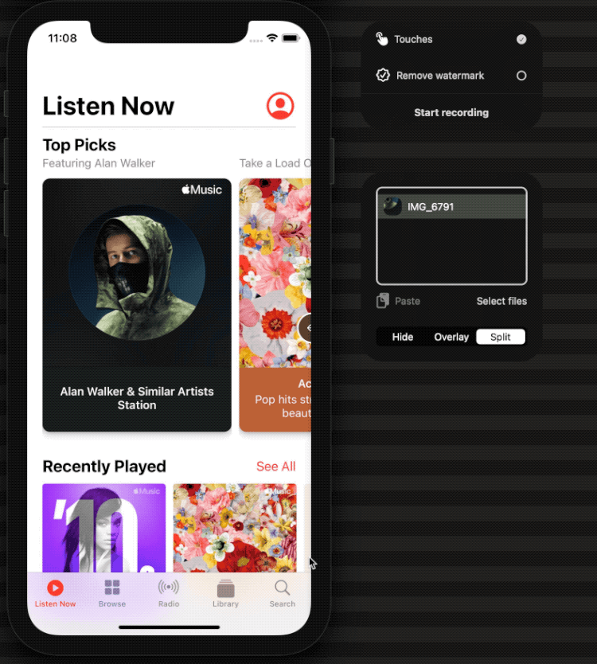
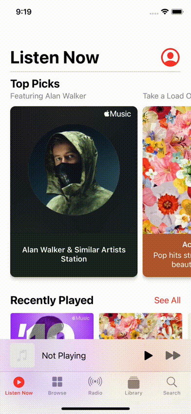

#  Rebuilt in SwiftUI

This project is about rebuilding some known Apps screen in SwiftUI. 
It's not about cloning the functionality, but to try to use the standard SwiftUI components to build a look-alike UI.

This project is about learning to apply SwiftUI.

There are screens going to be build for macOS and iOS. But not necessarily for both.

## iOS Music App UI clone

- "Listen Now" screen clone with "Top Picks" and "Recently Played"
- Basic interactions to trigger mini and fullscreen sheet player

